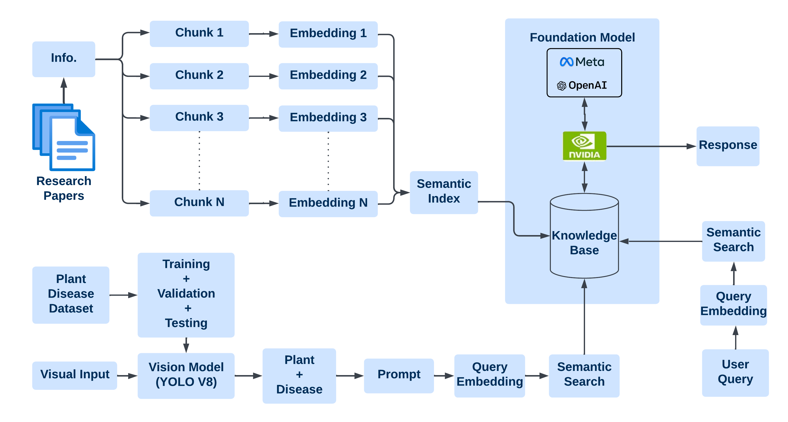
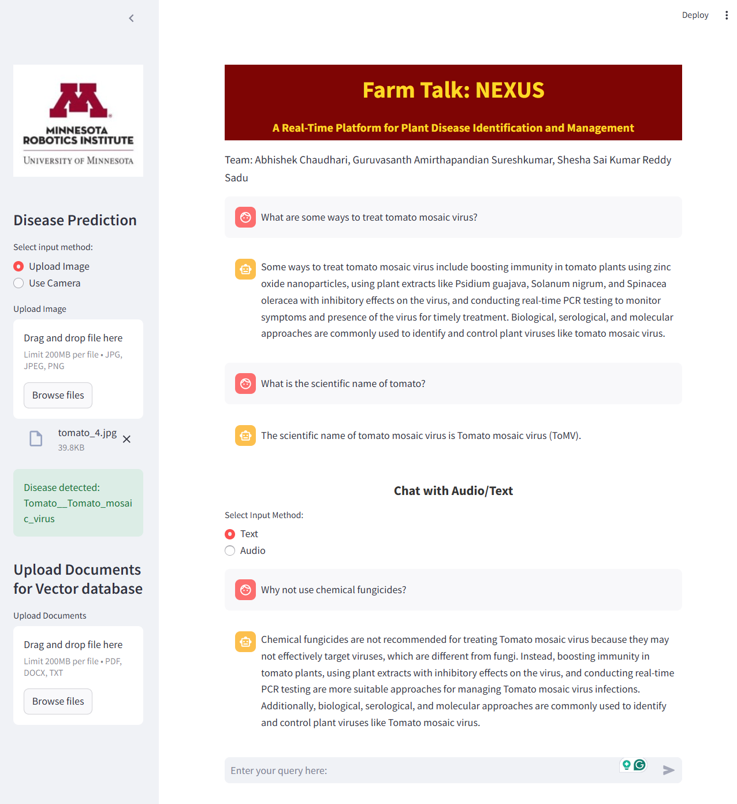

# Farm Talk: NEXUS
A Real-Time Platform for Plant Disease Identification and Management

## Introduction
Farm Talk: NEXUS is an innovative platform that combines computer vision and large language models (LLMs) to detect plant diseases in real time and provide actionable remediation strategies. This project integrates YOLOv8 for plant disease detection and a Retrieval-Augmented Generation (RAG) framework leveraging NVIDIAEmbeddings and FAISS for semantic search and retrieval. The solution is accessible via a user-friendly Streamlit interface, supporting both image uploads and live camera feeds.

This platform addresses the critical challenges of food security and sustainable farming by offering farmers, researchers, and policymakers a scalable, efficient, and accurate tool for crop disease management.

---

## Overall Project Architecture
The architecture of Farm Talk: NEXUS combines YOLOv8 for object detection and GPT-3.5 Turbo for context-aware remediation via the RAG framework.



---


## Setup Instructions

### Clone Repository
```bash
$ git clone https://github.com/abhishekvchaudhari/FarmTalk-Nexus-Vision-LLM-RAG
```

## Open in VS code
```bash
$ cd <project-folder>
$ code .
```

## Create and Activate Virtual Environment
```bash
$ conda create -n farmtalk python=3.10
$ conda activate farmtalk

```
## Install Dependencies
```bash
$ pip install -r requirements.txt
```

## Pre Process Datset for YOLOv8
Dowload the New Plant Diseases Dataset from [Kaggle](https://www.kaggle.com/datasets/vipoooool/new-plant-diseases-dataset/data)
Create the following directory structure:

dataset/
│
├── Images/
│   ├── Train/
│   └── Val/
│
└── labels/
    ├── Train/
    └── Val/

Now to generate the annotations for the images, run the following command:
```bash
$ python yolo_create_annotation.py
```

Then, to move the respective images and correct their filename, run the following command:
```bash
$ python yolo_create_annotation.py
```
Note: You can change which classes are used to train by changing the class_mappings in yolo_create_annotation.py, allowed_classes in yolo_create_annotation.py and names in data.yaml.


## Train the YOLOv8 Model
Ensure your data is organized correctly with separate folders for training and validation containing "images" and "labels." Update the data.yaml file accordingly to the correct paths. Run the following command to train the model:

To train the model, run the following command:
```bash
$ python yolo_train.py
```
## Inference with trained YOLOv8 Model(optional)
To perform inference:

run the command:
```bash
$ python yolo_inference.py
```
This will display predicted classes in your terminal.


# LLM using NVIDIA NIM

## NVIDIA NIM APIs or Endpoints
Get the foundational models from the NVIDIA NIM APIs or endpoints:
- [NVIDIA NIM Explore](https://build.nvidia.com/explore/discover)
- [NVIDIA AI Endpoints Documentation](https://python.langchain.com/v0.2/docs/integrations/chat/nvidia_ai_endpoints/)

### Model and API Keys

- Create a `.env` file in the root directory and save your API key:
  ```env
  NVIDIA_API_KEY="-------your_API_Key-----------"
  ```


## Run LLM Response
To get the LLM response, run the following command:
```bash
$ streamlit run nexus_main.py
```

## GPT-3.5 Turbo Setup

### API Key Setup
1. Go to the [OpenAI API](https://platform.openai.com/) and sign in to your account.
2. Navigate to the "API Keys" section and generate a new key.
3. Save the API key securely.

### Using GPT-3.5 Turbo in FarmTalk
1. Create a `.env` file in the root directory and add the following line:
   ```env
   OPENAI_API_KEY="your_openai_api_key"


## Experimental Setup

The experimental setup includes:

- **Hardware**:
  - A web camera for capturing real-time images of plants.
  - A potted tomato plant used as a test case for detecting diseases like "Tomato Mosaic Virus."
  - A laptop running the Farm Talk: NEXUS Streamlit interface for disease detection and user interaction.

- **Software**:
  - YOLOv8 for plant disease detection.
  - GPT-3.5 Turbo integrated with a Retrieval-Augmented Generation (RAG) framework for context-aware responses.

### UI
The user interface (UI) serves as the bridge between the hardware setup and the software models. It is designed to:
1. **Disease Detection**:
   - Allow users to upload images or use a live camera feed for plant disease detection.
   - Display the detected disease and related metrics in real time.
   
2. **Interactive Chat**:
   - Enable users to ask disease-related queries via text or audio.
   - Provide actionable responses and remediation suggestions.

3. **Knowledge Base Integration**:
   - Allow users to upload relevant research documents to create a custom knowledge base.
   - Perform semantic searches for disease-specific insights.

### Figure: Streamlit User Interface
Below is an example of the **Farm Talk: NEXUS** UI, showcasing its accessibility and functionality.




This interface ensures a seamless and practical workflow for farmers, researchers, and policymakers, making the tool suitable for real-world agricultural applications.

## Results and Discussion

### YOLOv8 Metrics
- **Precision:** 99.3%
- **Recall:** 99.4%
- **mAP@[0.5]:** 99.4%

### Human Evaluation Metrics
For the RAG Framework:
- **Relevance:** 4.5
- **Fluency:** 4.52
- **Factuality:** 4.44
- **User Satisfaction:** 4.52

### Key Insights
1. High precision and recall demonstrated the effectiveness of YOLOv8 in accurately identifying plant diseases.
2. The RAG Framework provided reliable and context-specific remediation, addressing key issues such as hallucination and irrelevance in language models.
3. Challenges such as poor lighting conditions and overlapping leaves in dense foliage highlighted areas for future improvement, including dataset diversity and multi-modal data integration.

> The evaluation metrics and insights underscore the potential of integrating computer vision with LLMs to deliver impactful solutions for real-world agricultural challenges.


Your feedback and collaboration are greatly appreciated.
